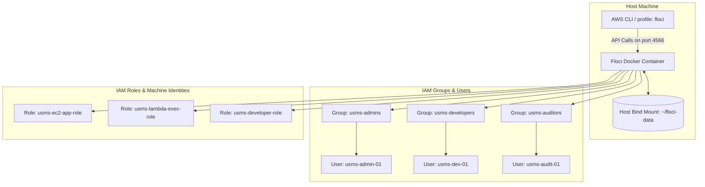

# Lab 1 - Identity and Access Management (IAM) Report

## 1. Aim / Objective
State the objective(s) of this practical exercise.
*Example:* To bootstrap the local AWS emulator environment using Docker Compose, create and manage IAM users, groups, roles, and policies using the AWS CLI, and verify permissions against the principle of least privilege.

---

## 2. Introduction
*Provide a brief overview of the AWS Identity and Access Management (IAM) service explored during this practical (1 paragraph).*

It should include:
- **Purpose of the service:** What does IAM do in AWS?
- **Key features:** Users, Groups, Roles, Policies, and STS.
- **Importance in cloud computing:** Why is identity management and access control critical?
- **Typical applications:** Human user access, application/machine role delegation, and programmatic access.

---

## 3. Use Case
*Describe where this AWS service is commonly used.*

*Examples:*
- **Least-Privilege Role Isolation:** Assigning specific policies to developer, admin, and audit groups rather than attaching policies directly to individuals.
- **Cross-Service Machine Permissions:** Attaching an instance profile/role to an EC2 instance so that the application can read from an S3 bucket without hardcoded credentials.
- **Temporary Access Delegation:** Using AWS STS (Security Token Service) to obtain short-lived credentials for external or temporary access.

---

## 4. System Architecture / Design (If Applicable)
*Insert a system architecture or workflow diagram illustrating how the AWS/Floci services and IAM structures interact.*



---

## 5. Implementation Procedure
*Briefly document each step performed during the practical. Keep them concise and highlight the commands/concepts.*

### PART A — Environment Setup
- **Step 1 - Step 4:** Checked system architecture, Docker environment, and installed Floci CLI. Ran `floci doctor` to ensure readiness.
- **Step 5 - Step 6:** Created workspace directories (`configs`, `policies`, `scripts`, `outputs`) and initialized Git, confirming `.gitignore` blocks secrets in `outputs/`.
- **Step 7 - Step 9:** Configured `docker-compose.yml` with `FLOCI_STORAGE_MODE=hybrid` and bind mount to `~/floci-data`. Launched using `floci-up.sh` and verified health.
- **Step 10 - Step 12:** Installed AWS CLI v2 and set up the `floci` profile targeting `http://localhost:4566`.
- **Step 13 - Step 15:** Ran `whoami` commands to verify emulator isolation. Checked that data persists on the host.

### PART B — Building the IAM Foundation
- **Step 16 - Step 17:** Inspected empty account.
- **Step 18 - Step 20:** Created groups (`usms-admins`, `usms-developers`, `usms-auditors`) and users (`usms-admin-01`, `usms-dev-01`, `usms-audit-01`), and added users to their respective groups.
- **Step 21 - Step 23:** Created customer managed policies (`USMSDeveloperBase`, `USMSStudentDataReadWrite`, `USMSAssumeAppRoles`) and attached `ReadOnlyAccess` to the auditor group.
- **Step 24 - Step 25:** Used skeletal templates to create inline self-service policies.
- **Step 26 - Step 27:** Inspected the final setup and verified policy versions.
- **Step 28 - Step 30:** Created `usms-ec2-app-role` (with EC2 trust policy), `usms-lambda-exec-role` (with Lambda trust policy), and tested `sts assume-role` for developers.
- **Step 31 - Step 33:** Safely generated access keys and saved lab state.

---

## 6. Results and Evidence

### 6.1 CLI / SDK Output
*Include code blocks/screenshots showing executed commands and their outputs.*

```bash
# Example: Verification command to list created users
aws iam list-users --query "Users[*].UserName"
```
*Output:*
```json
[
    "usms-admin-01",
    "usms-dev-01",
    "usms-audit-01"
]
```

### 6.2 AWS Management Console Verification / Floci Status
*Provide screenshots from the LocalStack Web Console or local status dashboards confirming successful resource creation or configuration, and write a one-line explanation of the action performed.*

*Example:*

*Explanation: Showing created IAM users list confirming programmatic setup.*

---

## 7. Analysis and Discussion
*Discuss the outcomes of the practical.*

- **What was achieved?** (e.g., local AWS sandbox successfully provisioned, durable hybrid persistence established, least-privilege IAM configuration created).
- **Expectation Matching:** Did the outputs match what the guide expected?
- **Errors and Solutions:** What issues did you face (e.g., port binding issues, malformed JSON policies)? How did you solve them?
- **Observations:** Note how IAM policies behave, trust relationships vs identity policies, and why hybrid storage is preferred.

---

## 8. Reflection
*Reflect on your learning experience by answering the following questions:*

1. **What did you learn about this AWS service?**
2. **What challenges did you encounter?**
3. **How would you apply this service in a real-world cloud environment?**
4. **What additional concepts or features would you like to explore?**

---

## 9. Conclusion
*Summarize the practical in one or two paragraphs.*

Discuss whether the objectives were achieved, key concepts learned, skills developed (such as jq/JMESPath queries, CLI structure), and why IAM forms the secure foundation of any cloud deployment.

---

## 10. Appendix (Optional)
*Include links to any supplementary materials.*

- [Policy Documents Directory](../../policies/)
- [Environment Configurations](../../configs/)
- [Helper Scripts](../../scripts/)

---

## Submission Checklist
- [ ] Aim/Objectives clearly stated
- [ ] Introduction provided
- [ ] Real-world use case described
- [ ] System architecture diagram included
- [ ] All implementation steps documented
- [ ] CLI/SDK screenshots/code blocks included
- [ ] AWS Console/Floci verification screenshots included
- [ ] Analysis and discussion completed
- [ ] Reflection completed
- [ ] Conclusion written
- [ ] Appendix attached (if applicable)
