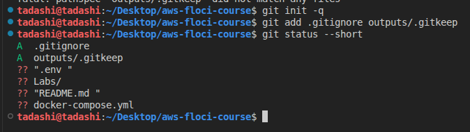
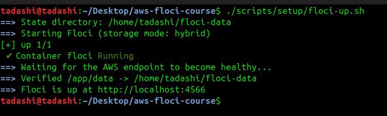
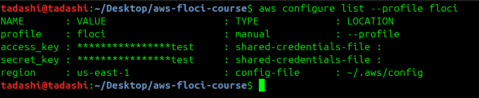

## 5. Implementation Procedure

### PART A — Environment Setup
- Step 1 - Step 4: Checked system architecture, Docker environment, and installed Floci CLI. Ran floci doctor to ensure readiness.

- Step 5 - Step 6: Created workspace directories (configs, policies, scripts, outputs) and initialized Git, confirming .gitignore blocks secrets in outputs/.
- 
- Step 7 - Step 9: Configured docker-compose.yml with FLOCI_STORAGE_MODE=hybrid and bind mount to ~/floci-data. Launched using floci-up.sh and verified health.
  
- Step 10 - Step 12: Installed AWS CLI v2 and set up the floci profile targeting http://localhost:4566.
  
- Step 13 - Step 15: Ran whoami commands to verify emulator isolation. Checked that data persists on the host.

### PART B — Building the IAM Foundation
- Step 16 - Step 17: Inspected empty account.

- Step 18 - Step 20: Created groups (usms-admins, usms-developers, usms-auditors) and users (usms-admin-01, usms-dev-01, usms-audit-01), and added users to their respective groups.
  
- Step 21 - Step 23: Created customer managed policies (USMSDeveloperBase, USMSStudentDataReadWrite, USMSAssumeAppRoles) and attached ReadOnlyAccess to the auditor group.
  
- Step 24 - Step 25: Used skeletal templates to create inline self-service policies.
  
- Step 26 - Step 27: Inspected the final setup and verified policy versions.
  
- Step 28 - Step 30: Created usms-ec2-app-role (with EC2 trust policy), usms-lambda-exec-role (with Lambda trust policy), and tested sts assume-role for developers.
  
- Step 31 - Step 33: Safely generated access keys and saved lab state.

## Results and Evidence

Writing a .gitignore and initialise Git




Ran the ./scripts/setup/floci-up.sh and the floci image is created and was able to access http://localhost:4566




Verifying if the floci in three independent ways (docker, floci status and curl) and found the floci is ready.


Created the floci AWS CLI profile

 

---
```cmd 
Your turn

Run aws configure list --profile floci. Identify which column tells you where each value came from, and explain why the Type for the access key says shared-credentials-file.
```


The ``TYPE`` column specifies where the AWS CLI resolved each setting from like we can see manual, shared credentials files and config-file. The type column says shared credentials files because AWS CLI separates non-sensitive settings from credentials. Non-sensitive configurations are saved in ~/.aws/config but sensitive credentials are kept in ~/.aws/credentials.

---

Persistence — the test that actually matters¶

The old version of this lab restarted Floci and observed that get-caller-identity still returned the same root ARN. That proves nothing: the root identity is a constant, and it comes back identically even in memory mode with no disk at all. A real persistence test has to create something, restart, and look for it again.

