## 1. Aim / Objective

The main aim of the Lab 2 is to design, provision, secure, and validate a highly available multi-tier VPC network infrastructure using the AWS CLI, enforcing strict network isolation between public and private workloads while verifying state persistence across system restarts.

The objectives of the lab 2 is : 
1. VPC & Subnet Topology
2. Tiered Network Defense
3. Outbound Routing & Service Integration

## 2. Introduction

Lab 2 is about hands on experience provisioning the core network architecture for the University Student Management System (USMS) using the AWS CLI. Where I created a custom VPC across multiple Availability Zones, implement defense-in-depth using stateful Security Groups and stateless NACLs and configure secure outbound connectivity via a NAT Gateway and an S3 VPC Endpoint. Through CLI-driven automation, resource tagging governance, and persistence testing, you will master the operational fundamentals of secure AWS networking.

## 3. Use Case

The use case are :
- Web/App Tier (Public Subnets)
- Database/Application Tier (Private Subnets)
- Secure Maintenance & Outbound Access
- Cost-Optimized Service Access

## 4. System Architecture / Design


## 5. Implementation Procedure

1. Step 1: Discover Account and Region Information

- Queried the current AWS caller identity and configured environment variables ($AWS_REGION_COURSE, $AWS_ACCOUNT_ID) to ensure all deployment commands target the intended local region and scope.

2. Step 2: Create usms-vpc

- Provisioned the central Virtual Private Cloud using CIDR block 10.0.0.0/16 and tagged it Name=usms-vpc and Project=USMS to establish the foundational network boundary.

3. Step 3: Enable DNS Resolution and Hostnames

- Modified VPC attributes to set enableDnsSupport=true and enableDnsHostnames=true, allowing instances within the network to automatically resolve AWS public/private DNS endpoints.

4. Step 4: Create Public Subnet A

- Carved out usms-public-subnet-a with CIDR 10.0.1.0/24 in Availability Zone us-east-1a for public-facing web infrastructure.

5. Step 5: Create Public Subnet B

- Carved out usms-public-subnet-b with CIDR 10.0.2.0/24 in Availability Zone us-east-1b to establish multi-AZ redudancy for the public tier.

6. Step 6: Create Private Subnet A

- Carved out usms-private-subnet-a with CIDR 10.0.3.0/24 in us-east-1a to host isolated application and database workloads.

7. Step 7: Create and Attach the Internet Gateway

- Provisioned usms-igw and attached it to usms-vpc, creating the entry/exit point for public internet traffic.

8. Step 8: Create and Configure the Public Route Table

- Created usms-public-rt, added a default route (0.0.0.0/0) pointing to usms-igw, and associated it with both public subnets (A and B).

9. Step 9: Allocate Elastic IP and Create NAT Gateway

- Allocated usms-nat-eip and built usms-nat in usms-public-subnet-a to facilitate secure outbound internet access for private workloads.

10. Step 10: Create and Configure the Private Route Table

- Created usms-private-rt, added a default route (0.0.0.0/0) pointing to usms-nat, and associated it with usms-private-subnet-a.

11. Step 11: Create the Application Security Group

- Provisioned usms-app-sg within usms-vpc to govern stateful network access for backend application instances.

12. Step 12: Configure Inbound Rules for Application Security Group

- Added ingress rules allowing HTTP/HTTPS traffic from the public subnets into usms-app-sg.

13. Step 13: Create the Database Security Group

- Provisioned usms-db-sg within usms-vpc to enforce strict access controls on internal data stores.

14. Step 14: Restrict Inbound Access for Database Security Group

- Configured an inbound rule allowing PostgreSQL/MySQL access to usms-db-sg only if the source traffic originates from usms-app-sg.

15. Step 15: Create Custom Network ACL for Private Subnet

- Created usms-private-nacl as a stateless subnet-level security barrier and associated it directly with usms-private-subnet-a.

16. Step 16: Configure Inbound Rules for Private NACL

- Defined numbered ingress rules allowing ephemeral return traffic and local VPC subnets while dropping unauthorized protocol requests.

17. Step 17: Configure Outbound Rules for Private NACL

- Defined egress rules permitting outbound traffic to internal subnets, S3 prefix lists, and NAT Gateway destinations.

18. Step 18: Verify Security Group and NACL Interoperability

- Executed CLI query dry-runs to validate that stateful SGs and stateless NACLs do not conflict, upholding defense-in-depth principles.

19. Step 19: Audit Network Route Tables

- Queried public and private route tables to confirm proper target associations (IGW for public subnets, NAT for private subnets).

20. Step 20: Provision S3 Gateway VPC Endpoint

- Created usms-s3-endpoint and attached it to usms-private-rt, enabling direct, free S3 network access without traversing the NAT Gateway.

21. Step 21: Verify S3 Endpoint Managed Routes

- Inspected usms-private-rt to confirm the automatic injection of S3 prefix list routes (pl-xxxxxxxx).

22. Step 22: Audit Global Project Tags

- Ran aws ec2 describe-tags with filters to ensure all VPC resources strictly comply with governance tagging (Project=USMS).

23. Step 23: Perform Pre-Restart State Baseline Snapshot

- Recorded resource counts (VPC, Subnets, Security Groups) to outputs/lab-02-pre-restart.txt prior to restarting the emulator.

24. Step 24: Restart Floci Emulator and Verify Persistence

- Stopped and started the Floci daemon, re-queried API resource IDs by tag, generated outputs/lab-02-post-restart.txt, and ran diff to prove 100% network state persistence.

25. Step 25: Save Persistent Environment File

- Exported all 11 verified resource variables into configs/lab-02.env to allow seamless variable inheritance for subsequent labs.
  
## 6. Results and Evidence

For the lab 2 we need to check the set up and found that the prerequistes not present

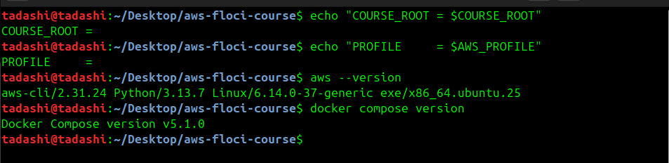

To solve the issue I follwed the folowing step. 

1. opended the nano ~/.bashrc and looked for the sources configs/course.env 

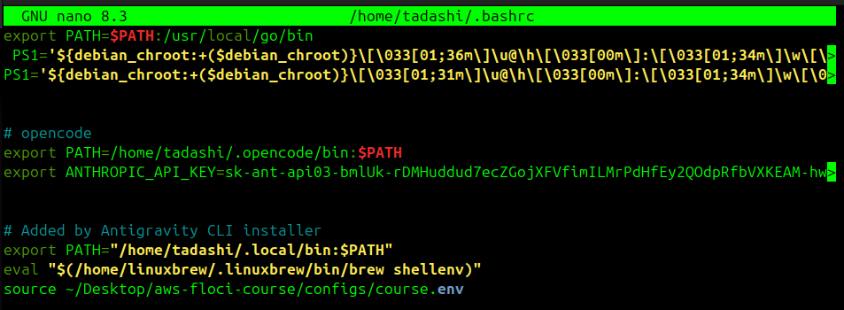

2. Reloaded the shell configuration and verified the output again 

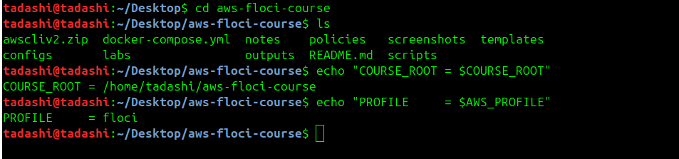

In this Lab 2 we are trying to build the University student management system that has ``web tire`` where a students and staff can reach through internet, ``data tire`` that holds transcripts and enrolment records that can never be reachable from the internet. Plus the requirement the data tire can fetch operating system updates outbound. 

## Step 1 Resume the environment

Ensuring that the floci environemnt is running and using the persistent storage. 

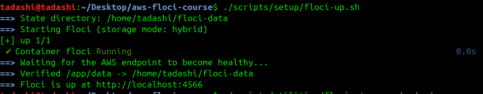

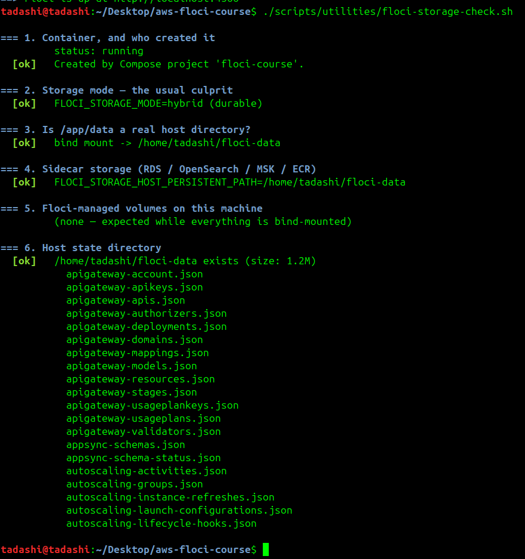

After running the commands, found that the everything is correctly configured and working. 

## Step 2 : Load the previous lab's environment and confirm your identity

This loads the key value created in the Lab1 and check the safety for target AWS account. 
It pulls the variables like developer role name, developer user and account ID by running lab-01.env and checks the target to make sure it is talking to the local emulator in ``000000000000`` at ``http://localhost:4566``

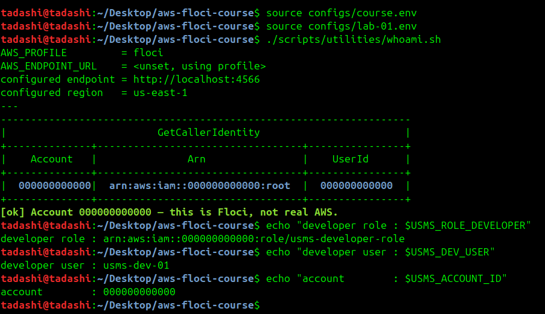

## Step 3 : Assume the developer role and create the VPC 

The first policy ``USMSDeveloperBase`` defines the minimum AWS service permissions required for developers to interact with application resources and prevent unauthorized access and ensures all developer execute under control. The json output shows the every ``Allowed`` or ``Deny`` action and resources assigned by the policy.

```cmd
tadashi@tadashi:~/Desktop/aws-floci-course$ echo "default version: $DEFAULT_VERSION"
default version: v3
tadashi@tadashi:~/Desktop/aws-floci-course$ aws iam get-policy-version \
  --policy-arn "$POLICY_ARN" \
  --version-id "$DEFAULT_VERSION" \
  --query 'PolicyVersion.Document' \
  --output json | tee outputs/lab-02-developer-base.json

{
    "Version": "2012-10-17",
    "Statement": [
        {
            "Sid": "ReadInfrastructure",
            "Effect": "Allow",
            "Action": [
                "iam:Get*",
                "iam:List*",
                "ec2:Describe*",
                "s3:List*",
                "s3:GetBucketLocation",
                "cloudwatch:Describe*",
                "cloudwatch:Get*",
                "logs:Describe*",
                "logs:GetLogEvents",
                "sts:GetCallerIdentity"
            ],
            "Resource": "*"
        },
        {
            "Sid": "BuildNetworkingForLab02",
            "Effect": "Allow",
            "Action": [
                "ec2:CreateVpc",
                "ec2:CreateSubnet",
                "ec2:CreateRouteTable",
                "ec2:CreateRoute",
                "ec2:CreateInternetGateway",
                "ec2:AttachInternetGateway",
                "ec2:AssociateRouteTable",
                "ec2:CreateSecurityGroup",
                "ec2:AuthorizeSecurityGroupIngress",
                "ec2:CreateTags",
                "ec2:ModifyVpcAttribute",
                "ec2:DeleteVpc",
                "ec2:DescribeAvailabilityZones"
            ],
            "Resource": "*",
            "Condition": {
                "StringEquals": {
                    "aws:RequestedRegion": "us-east-1"
                }
            }
        },
        {
            "Sid": "DenyDangerousIdentityChanges",
            "Effect": "Deny",
            "Action": [
                "iam:CreateUser",
                "iam:DeleteUser",
                "iam:CreateAccessKey",
                "iam:AttachUserPolicy",
                "iam:PutUserPolicy",
                "aws-portal:*",
                "organizations:*"
            ],
            "Resource": "*"
        }
    ]
}
tadashi@tadashi:~/Desktop/aws-floci-course$ 
```

## Assumming the role

Here I performed the temporary security credentials assumption through : 
1. Calling the aws security token service ( STS ) to request temporary access credentials (Access Key, Secret Key, and Session Token) for the role specified in $ROLE_ARN.
2. Saves the STS response containing the temporary credentials into a local file in ``outputs/lab-02-assumed-role.json``
3. Sets strict file permissions so only your local Linux user can read or write the credentials file by ``chmod 600 outputs/lab-02-assumed-role.json``
4. Confirms that your active shell identity has successfully changed from the base user to the assumed role context by ``aws sts get-caller-identity``

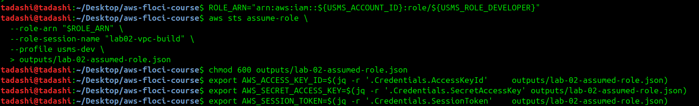


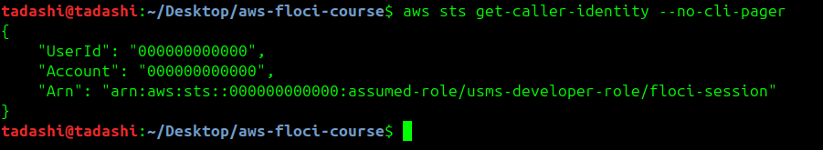

## Creating the VPC

Creating the VPC uses the /16 IPv4 address. 
1. It calls the Amazon Elastic Compute Cloud APIs, which govern core networking primitives in addition to compute instances. 
2. Allocates a contiguous private address space of 65,536 total IPv4 addresses (10.0.0.0 to 10.0.255.255). 
3. Applies four key metadata tags (Name, Project, Tier, ManagedBy) in the same single API call as resource creation.

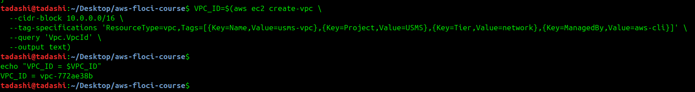

## Step 4 Restore your normal identity

``usms-developer-role`` was created with a one-hour maximum session duration, these credentials will expire later in the lab so to prevent this it revokes the temporary session credentials assumed role by : 
1. Removing the temporary IAM role credentials from your terminal's environment variables.
2. Confirms your active caller identity has reverted back to the baseline identity ( arn:aws:iam::000000000000:root )

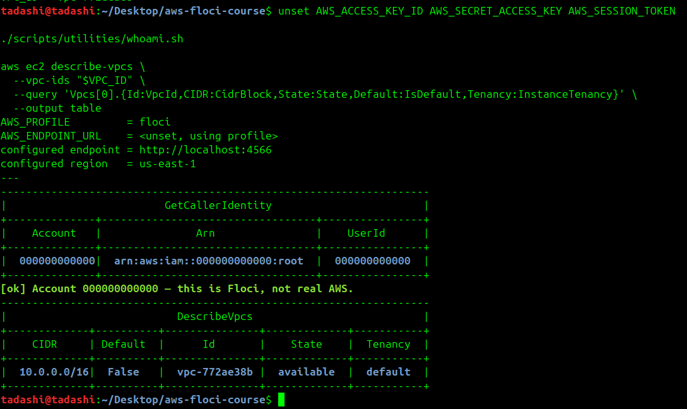

## Step 5 Enable DNS support and DNS hostnames

The VPC created from the CLI has DNS resolution on but DNS hostnames off. Without hostnames, an instance with a public IP gets no public DNS name. 

The two command configure the built-in DNS resolution services for custom AWS Virtual Private Cloud (VPC) by

1. ``--enable-dns-support '{"Value":true}'`` that enables the DNS inside the VPC .
2. ``--enable-dns-hostnames '{"Value":true}'`` that assignes automatic DNS hostnames in the VPC

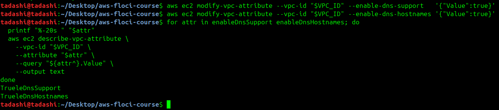

To verify the both DNS attributes were successfully enabled on the VPC in the enabling DNS and DNS hostname.

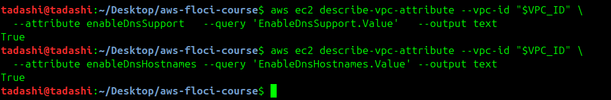


## Step 6 Create and attach the internet gateway

It provides Internet Gateway (IGW) the logical edge router that connects the custom VPC to the public internet and attaches it to usms-vpc. It enables bidirectional communication between public subnet resources and external networks, as well as 1-to-1 Static NAT translation for public IP addresses.

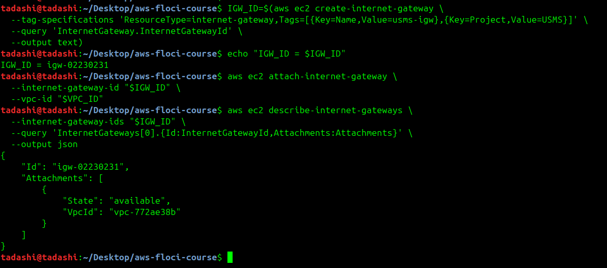


## Step 7 Create the public subnet in us-east-1a

It provides Subnet within the VPC scoped to a specific Availability Zone (us-east-1a). It reserves a dedicated /24 IPv4 block (10.0.1.0/24)

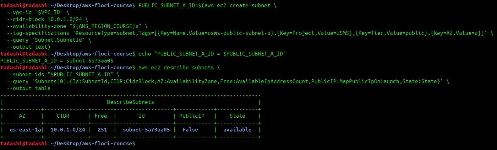

* state is available
* IP address is reserved from 251 
* PublicIP is set to false

## Step 8 Turn on auto-assign public IPv4 for the public subnet¶

It modifies the attribute settings of usms-public-subnet-a to automatically allocate a public IPv4 address to any EC2 instance launched within it. This eliminates the requirement to manually assign public IPs during compute provisioning.

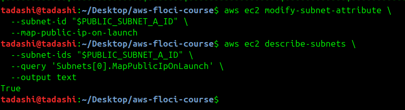

## Step 9 Create the private subnet in us-east-1a

It provides an isolated Private Subnet (10.0.3.0/24) in Availability Zone us-east-1a to host sensitive workloads (e.g., database instances). Unlike the public subnet, this subnet is designed with zero internet connectivity and explicit restriction against public IP auto-assignment, implementing a defense-in-depth security model.

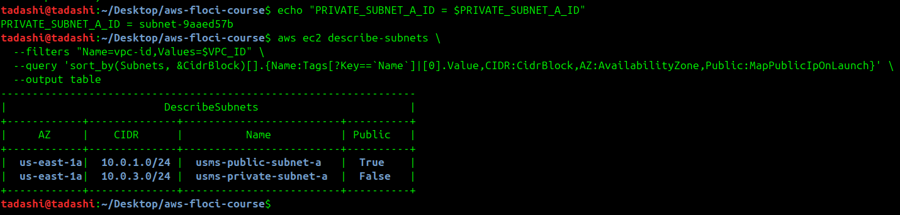

## Step 10 Create the public route table and the default route

transforms usms-public-subnet-a into a functionally public network segment by provisioning a custom Public Route Table and adding a Default Route (0.0.0.0/0) pointing to the Internet Gateway ($IGW_ID). This enables outbound and inbound internet connectivity while preserving internal VPC routing.

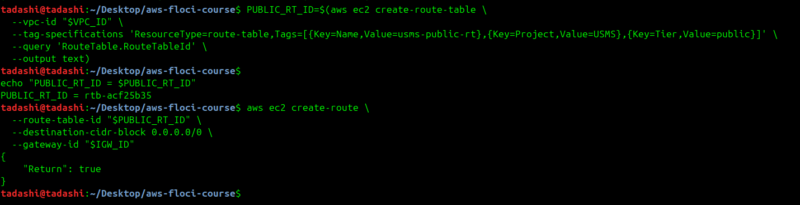

After verification the route table contains two active rules

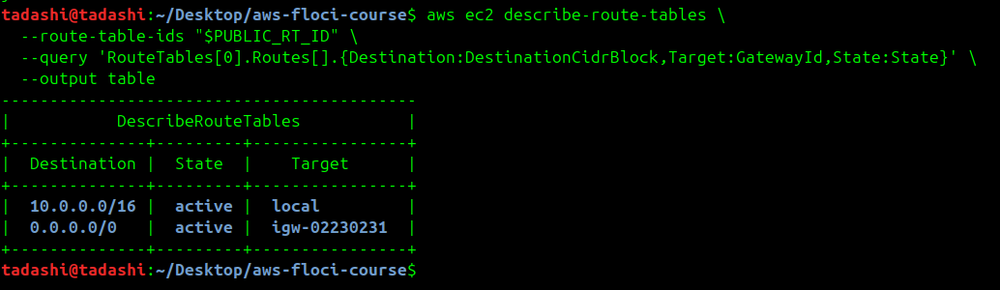

## Step 11 Associate the public subnet with the public route table

It binds usms-public-subnet-a to the Public Route Table ($PUBLIC_RT_ID) created in Step 10. Without explicit association, subnets fallback to the VPC's main route table which lacks internet routes. This association makes the subnet genuinely public.

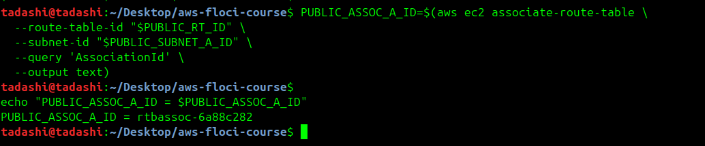

---

## Your turn

Following the step 7,8 and 11 Created ``usms-public-subnet-b`` with CIDR ``10.0.2.0/24`` in ``us-east-1b``

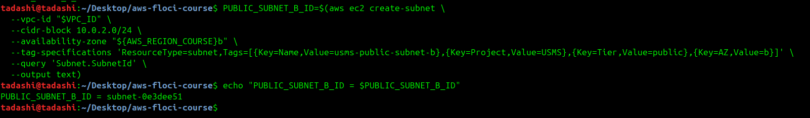

Enabled auto-assign public IPv4 address on launch and associate the new subnet with the public route table

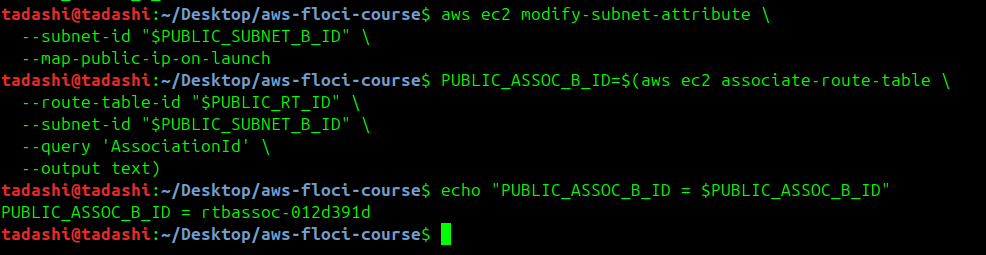


Verifing all 3 subnets in the VPC

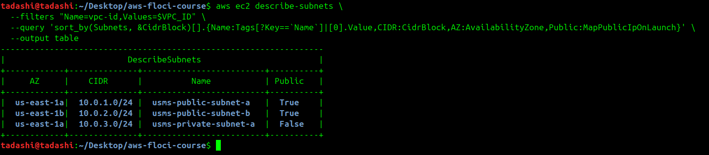

Verify public route table associations

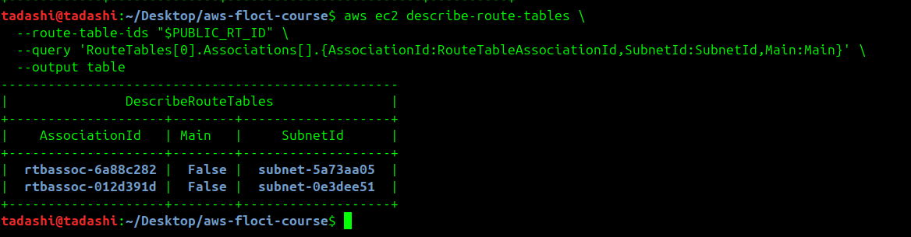

---

## Step 12 Create the private route table and associate the private subnet

It provides a dedicated Private Route Table (usms-private-rt) containing only the internal local route (10.0.0.0/16 -> local) and explicitly associates it with usms-private-subnet-a. This isolates the private subnet from the VPC's Main Route Table, guaranteeing zero internet access even if the Main Route Table is altered later.

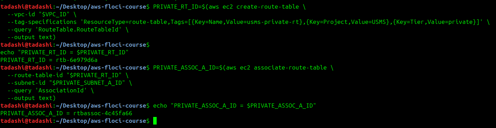


## Step 13 Prove the two subnets are actually different

It performs a formal validation audit of your network layout. By querying the AWS API for the effective route tables of both subnets, it empirically verifies that the public subnet routes outbound traffic to the Internet Gateway while the private subnet remains strictly isolated.

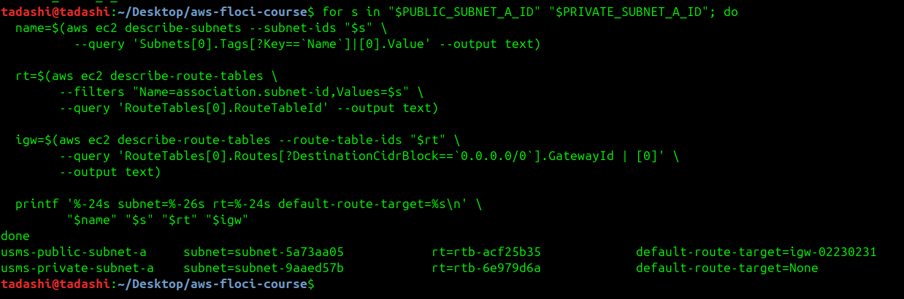

## Step 14 Create the application security group

It provides an instance-level firewall (usms-app-sg) inside $VPC_ID designed for public-facing web servers. It opens port 80 (HTTP) to external internet users while restricting port 22 (SSH) strictly to internal VPC addresses (10.0.0.0/16), adhering to the principle of least privilege.

AWS assigns a specific sgr- ID to every individual security group rule. The result shows three unique resource identifiers returned sequentially.

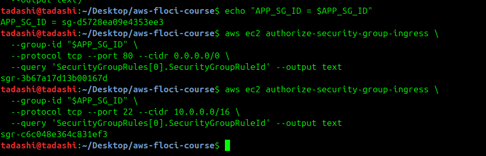

---
Your turn 

Added an inbound rule to usms-app-sg allowing TCP 443 from 0.0.0.0/0, and give the rule a description so that a future reader knows why it is there.

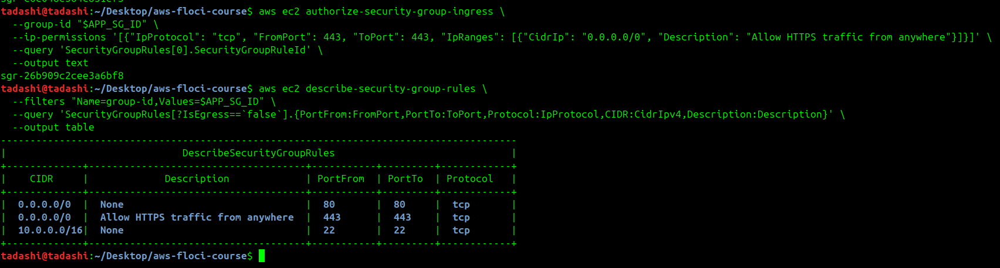

---

## Step 15 Create the database security group, sourced from the application group

It provides the firewall shell (usms-db-sg) for the private database tier inside $VPC_ID. It establishes the isolated security boundary for data resources prior to defining specific ingress authorization rules.

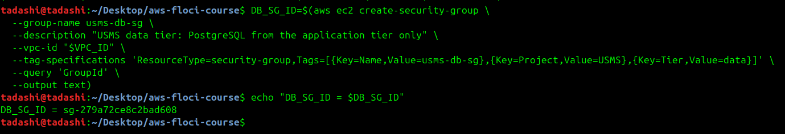

Second part of the command creates a local JSON configuration file (policies/usms-db-sg-ingress.json) that defines an ingress rule allowing PostgreSQL traffic (port 5432) into the database tier. Instead of referencing static IP ranges, it explicitly targets the Application Security Group ($APP_SG_ID) as the authorized traffic source.

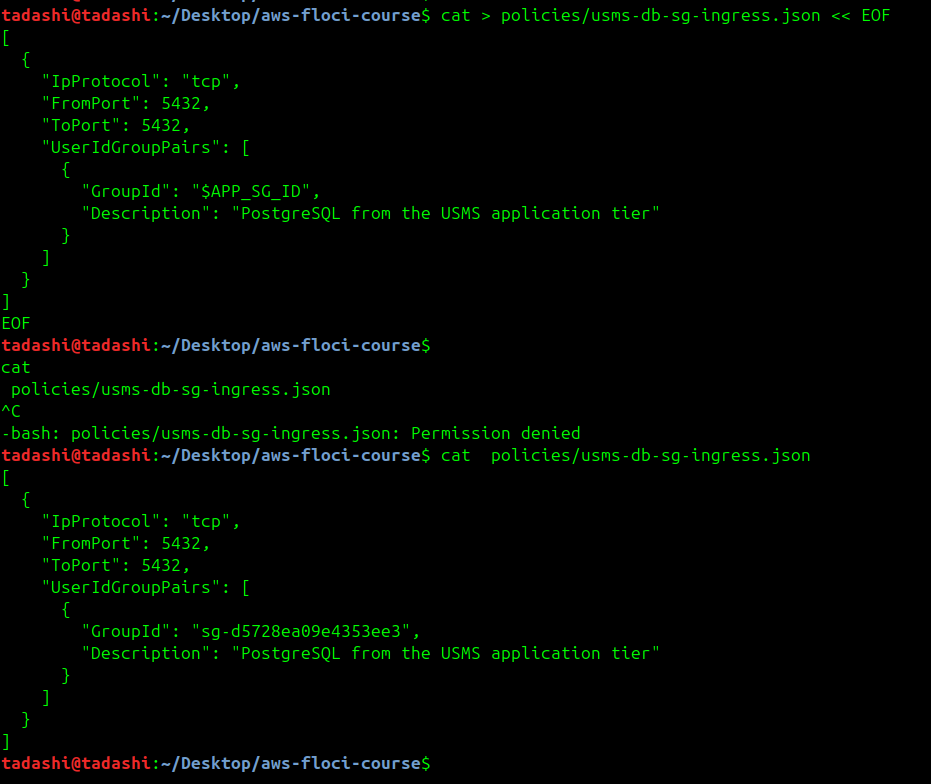

Third part of the command reads the JSON specification created in Part 2 (policies/usms-db-sg-ingress.json) and applies it to the Database Security Group ($DB_SG_ID). This officially authorizes PostgreSQL traffic (port 5432) originating strictly from resources attached to usms-app-sg.

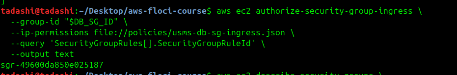

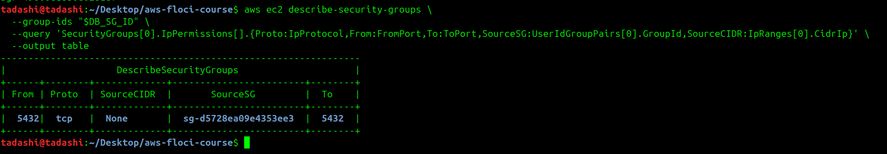


## Step 16 Read the groups back, and understand what stateful means

It performs a consolidated audit of all Security Groups in $VPC_ID and walks through the lifecycle of a full client-to-application-to-database request. It demonstrates the administrative efficiency of stateful tracking, showing how two explicitly defined inbound rules automatically handle four network connection legs without manual response filtering.

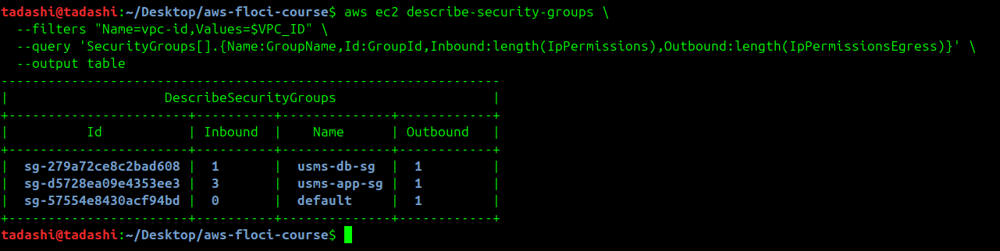

- JMESPath length() Function: Counts the elements in the IpPermissions (inbound) and IpPermissionsEgress (outbound) arrays for clean summary output.

- The default Security Group: Reveals the implicit fallback SG created automatically with every VPC. (If an EC2 instance is launched without specifying --security-group-ids, AWS attaches this default group, which blocks all public ingress).

## Step 17 Explore the default network ACL, then create a private one 

Part A of the command inspects the Default Network Access Control List (NACL) automatically created alongside your VPC. It illustrates how NACL rules are structured, evaluated sequentially by rule number, and how a default NACL acts as a pass-through filter (allow all) until custom subnet-level restrictions are introduced.

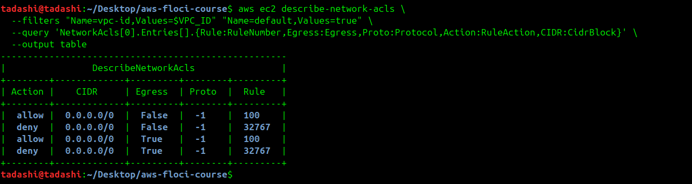

Part B of the command provide a custom Network Access Control List shell (usms-private-nacl) inside $VPC_ID. It creates an isolated, subnet-level security wrapper for the private database tier before specific stateless allow/deny rules are attached.

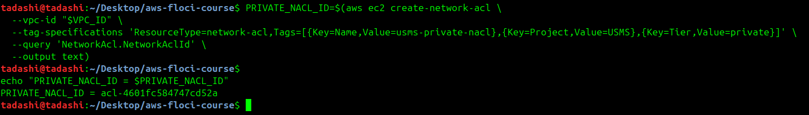

Part C of the command configures explicit, stateless packet-filtering rules on $PRIVATE_NACL_ID to strictly control inbound and outbound traffic for the private database tier. Because NACLs are stateless, rules must be defined in pairs to allow both the initial request and the corresponding return traffic on ephemeral ports.

- Inbound 100: PostgreSQL from anywhere inside the VPC.
- Inbound 110: return traffic for connections this subnet opened outbound.
- Outbound 100: replies to the application tier.
- Outbound 110: HTTPS out, so the data tier can fetch OS updates through the NAT gateway.

```cmd 
tadashi@tadashi:~/Desktop/aws-floci-course$ aws ec2 describe-network-acls \
  --network-acl-ids "$PRIVATE_NACL_ID" \
  --query 'NetworkAcls[0].Entries[].{Rule:RuleNumber,Egress:Egress,Action:RuleAction,CIDR:CidrBlock,Ports:PortRange}' \
  --output json
[
    {
        "Rule": 32767,
        "Egress": false,
        "Action": "deny",
        "CIDR": "0.0.0.0/0",
        "Ports": null
    },
    {
        "Rule": 32767,
        "Egress": true,
        "Action": "deny",
        "CIDR": "0.0.0.0/0",
        "Ports": null
    },
    {
        "Rule": 100,
        "Egress": false,
        "Action": "allow",
        "CIDR": "10.0.0.0/16",
        "Ports": {
            "From": 5432,
            "To": 5432
        }
    },
    {
        "Rule": 110,
        "Egress": false,
        "Action": "allow",
        "CIDR": "0.0.0.0/0",
        "Ports": {
            "From": 1024,
            "To": 65535
        }
    },
    {
        "Rule": 100,
        "Egress": true,
        "Action": "allow",
        "CIDR": "10.0.0.0/16",
        "Ports": {
            "From": 1024,
            "To": 65535
        }
    },
    {
        "Rule": 110,
        "Egress": true,
        "Action": "allow",
        "CIDR": "0.0.0.0/0",
        "Ports": {
            "From": 443,
            "To": 443
        }
    }
]
tadashi@tadashi:~/Desktop/aws-floci-course$ 

```

## Step 18 Associate the private NACL with the private subnet¶

It officially activates your custom stateless firewall (usms-private-nacl) by linking it to usms-private-subnet-a. Because every subnet in AWS is strictly required to have an active NACL at all times, you cannot simply "associate" a new one—you must find the existing association ID and atomically swap (replace) it using replace-network-acl-association.

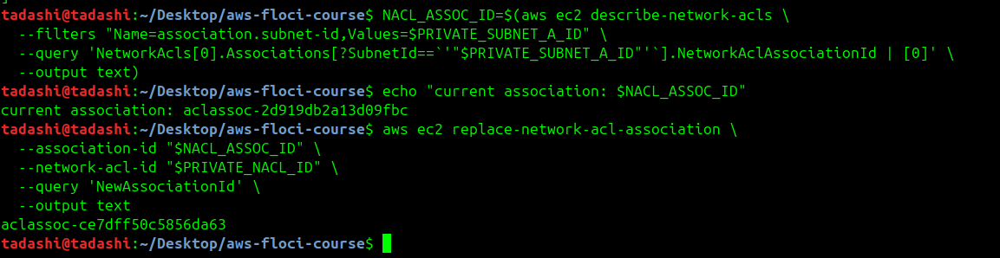

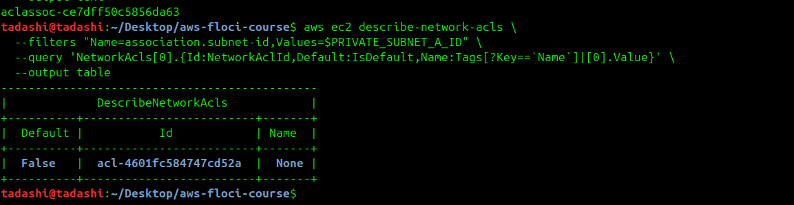

## Step 19 Give the private subnet outbound internet access with a NAT gateway

It step allocates a static, public IPv4 address (Elastic IP) within your VPC's scope on AWS. This public IP address will be assigned to the NAT Gateway in Part 2, giving instances in the isolated private subnet outbound internet connectivity (e.g., to pull OS and software updates) while keeping them shielded from incoming internet traffic.

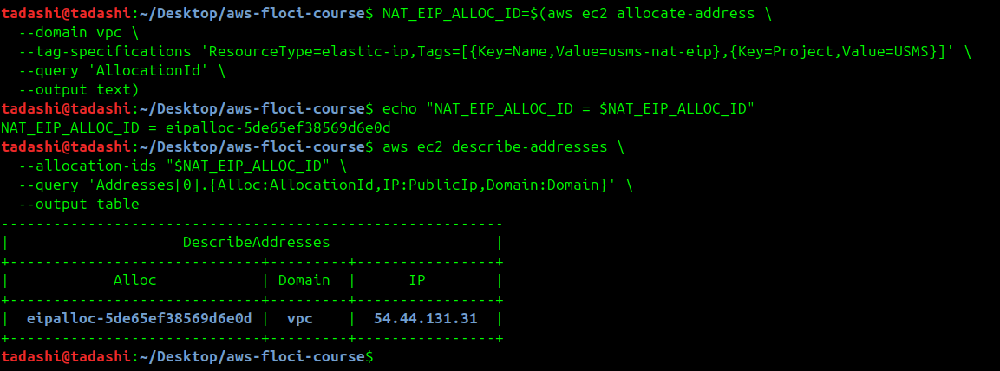

Part B of the command provides the NAT Gateway (usms-nat) inside the public subnet (usms-public-subnet-a) and attaches the Elastic IP ($NAT_EIP_ALLOC_ID) allocated in Part 1. This creates the managed network translation node required to route outbound traffic from your private subnet to the internet.

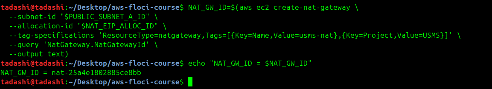

Part C of the command pauses script execution until the newly created NAT Gateway transitions from its initial pending state into the available state. AWS takes roughly 30 to 60 seconds to allocate elastic network interfaces and provision underlying underlying infrastructure for a NAT Gateway, during which time route table attachments will fail if attempted prematurely.

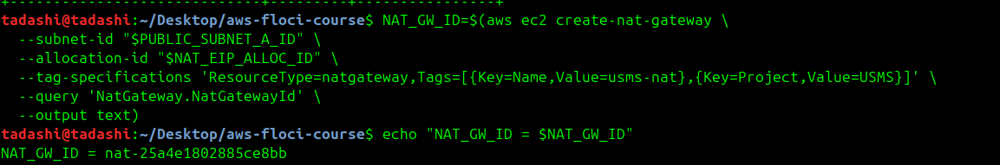

## Step 20 Point the private route table at the NAT gateway

It adds a default route (0.0.0.0/0) to the Private Route Table ($PRIVATE_RT_ID), directing all internet-bound traffic originating from the private subnet to the newly created NAT Gateway ($NAT_GW_ID). This completes the outbound networking path for the data tier.

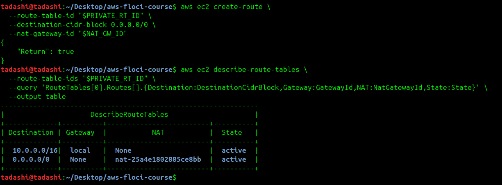


## Step 21 Create the S3 gateway endpoint

It provides an S3 Gateway VPC Endpoint (usms-s3-endpoint) for $VPC_ID and automatically injects a managed route into the private route table ($PRIVATE_RT_ID). This enables instances in the isolated private subnet to communicate with Amazon S3 directly over the private AWS network backbone—completely bypassing the NAT Gateway, eliminating data egress charges, and reducing latency.

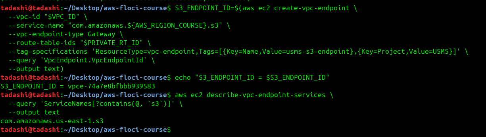

verification 

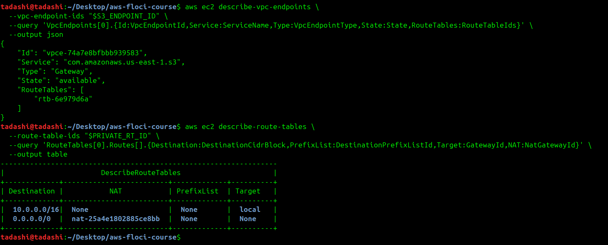

## Step 22 Audit your tags

It performs a global tagging audit across all EC2/VPC resources provisioned within your current region. It verifies compliance with project governance guidelines (specifically Section 11 of your course contract), ensuring every created resource carries the mandatory Project=USMS key-value pair.

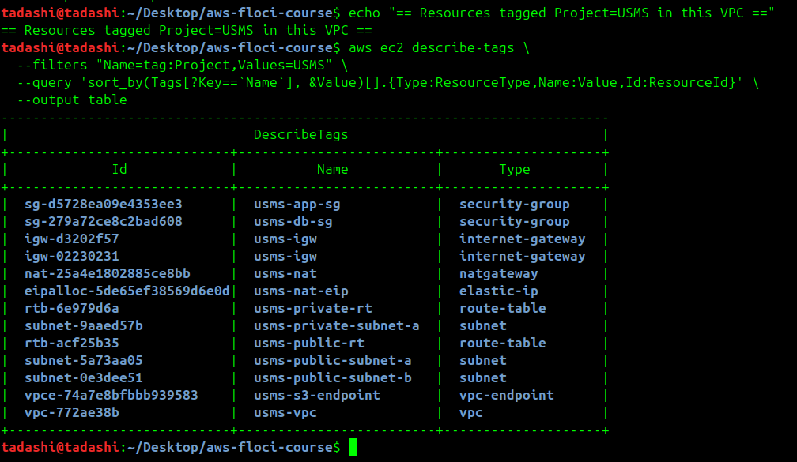

---
Your turn 
builds a formatted inventory of all subnets created inside usms-vpc. It filters resources strictly within your target VPC ($VPC_ID), extracts custom tags (Name and Tier), sorts the output so that private subnets appear first, and outputs a formatted table directly into the required report file (outputs/lab-02-subnet-inventory.txt).

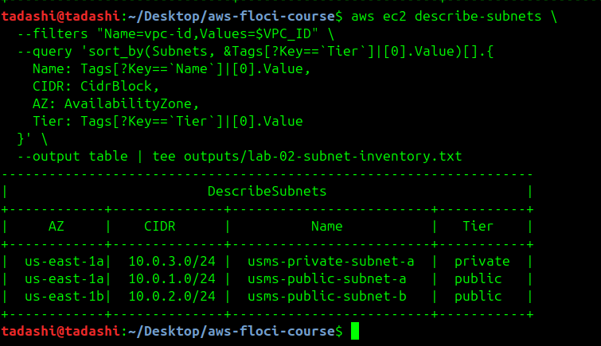

## Step 23 Prove the network survives a restart

It captures a baseline snapshot of your network state before restarting the Floci emulator. It records the primary VPC ID, the total subnet count, and the total security group count into outputs/lab-02-pre-restart.txt to establish the "ground truth" for state persistence.

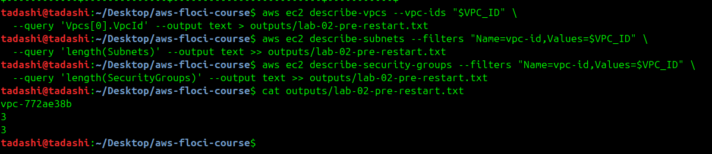

Part B of the command stops and restarts the local Floci AWS emulator service, introducing a controlled disturbance (perturbation) to test whether your network architecture state persists across daemon restarts.

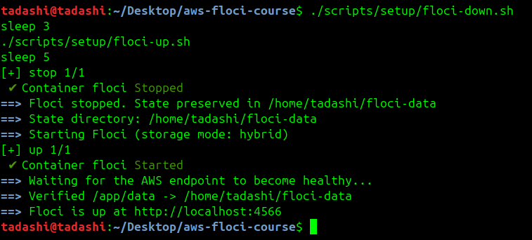

Part c of step is the final verification step re-establishes environment context and queries the API for your resources by tag search rather than using stored memory. It outputs the post-restart network counts to outputs/lab-02-post-restart.txt and performs a diff against your pre-restart snapshot (outputs/lab-02-pre-restart.txt) to confirm full state persistence across daemon restarts.

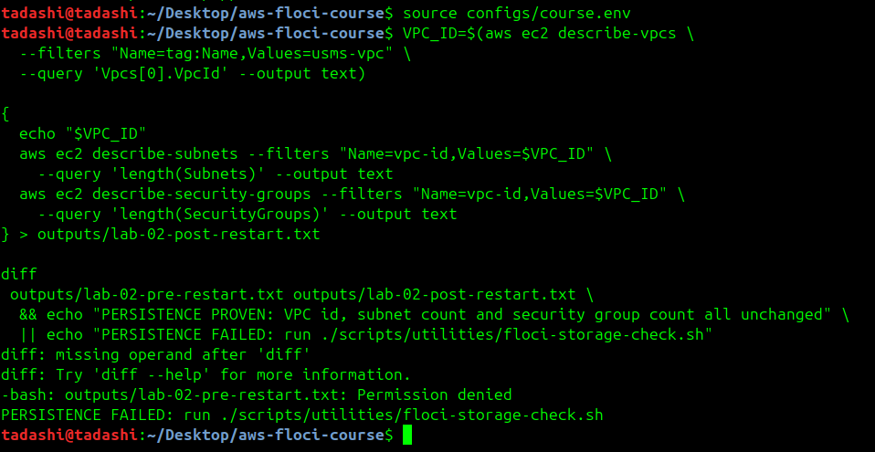

## Step 24 Write configs/lab-02.env

It saves every essential network resource ID (VPC, Subnets, Security Groups, Route Tables, NACL, NAT Gateway, EIP, Endpoint) into a persistent configuration file: configs/lab-02.env. This ensures downstream modules (Lab 3+) can source these variables instantly without needing to manually query AWS or re-declare environment variables.

configs/lab-02.env file is fully populated and verified.

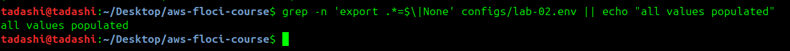

## Step 25 Commit your work


