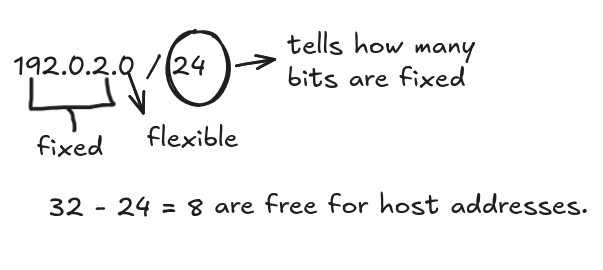

## Interlude CIDR ( classless inter-Domain Routing )

- An IPv4 address is a 32 bits and formatted as four 8 bit octal number (192.0.2.0).

- It uses the slash character (/) to indicate how many bits of routing must be fixed or allocation for the network identifier.

we can say that 2^8 = 256 IP addresses are available for the network raning from 192.0.2.2 to 192.0.2.255

CIDR follows a rule where ``smaller prefix number means a bigger network``

There are 5 reserved IPs per AWS subnet which reduces the IPs by 5

- .0 = network address
- .1 = VPC router
- .2 = Amazone DNS resolver 
- .3 = Reserved for future use
- .225 = Network broadcast address

3 rules of subnets
1. a subnet's CIDR must be a subset of the VPC's,
2. must not overlap any other subnet in that VPC
3. can never be changed after creation.